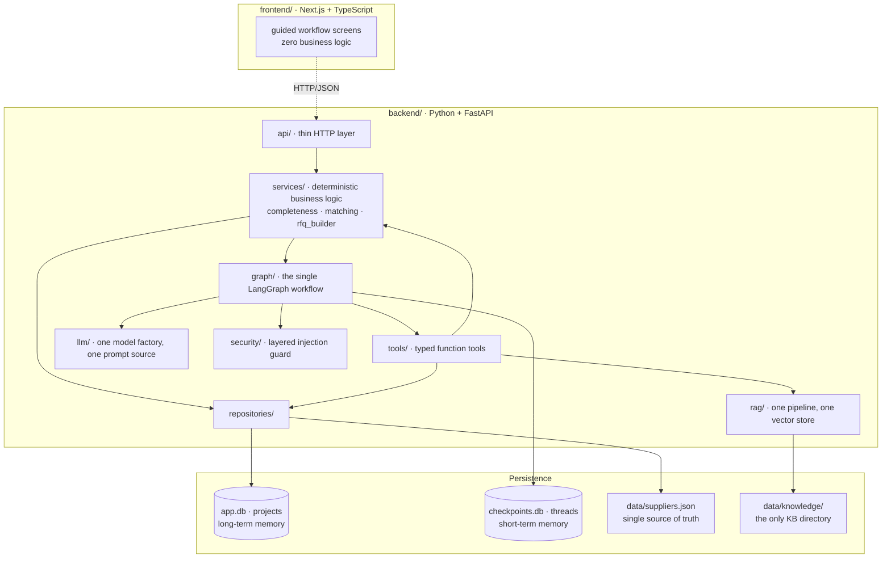
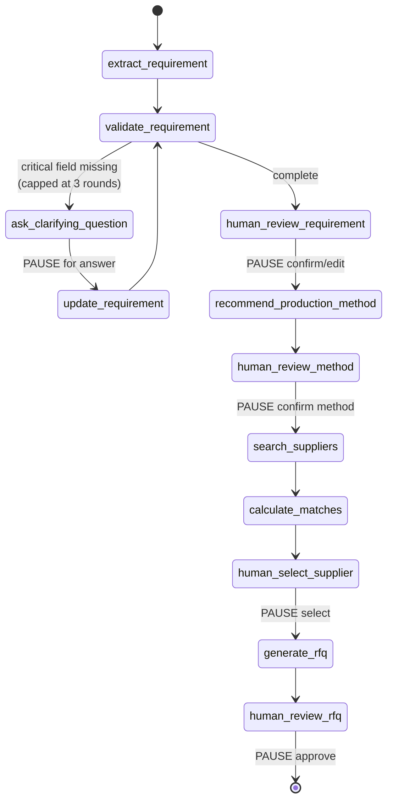

# Produce Your Stuff

**AI-powered B2B sourcing and production orchestration.** You already have the product and the design — describe what you want customised, and Produce Your Stuff works out *how* it can be made and *who* can make it.

> **Status: Phase 3 complete.** The full agent works end to end against a live model: natural language → typed brief → clarification → *knowledge-grounded* method recommendation → deterministic supplier matching → RFQ, with four human approval gates. The HTTP API surface and security guard (Phase 4) and the Next.js frontend (Phase 5) are still to come — see [Implementation status](#implementation-status). This README describes only what actually exists; the full approved design lives in [docs/architecture.md](docs/architecture.md).

---

## Problem

A Berlin SME with 100 black yoga mats and a gold logo currently has to work out which customisation technique is even appropriate, find production partners, discover whether any of them accept customer-owned goods, check minimum order quantities, compare capabilities, and then re-explain the same project to every supplier by hand. It is days of undifferentiated work before a single quote arrives.

## Solution

```
PRODUCT + DESIGN
      ↓  natural language, one box
AI understands the requirement      → typed Production Brief
      ↓  asks only what is genuinely missing
technical production recommendation → RAG-backed, with explicit uncertainty
      ↓  human confirms
qualified supplier matching         → deterministic score, AI only explains it
      ↓  human selects
production-ready RFQ                → human edits and approves
```

**The core promise:** describe what you want to customise; Produce Your Stuff figures out how and who can produce it.

**Target user:** Berlin SMEs, startups, creators and agencies needing a relatively small batch of customised physical products — branded yoga mats, engraved bottles, embroidered textiles, packaging, event merch, corporate gifts.

**Supported techniques:** laser engraving · printing (screen / digital / pad / heat-transfer foil) · embroidery · labels & packaging.

---

## Two principles that shape the whole codebase

**1. AI recommends, humans decide.** Four explicit approval gates — the Production Brief, the production method, the supplier, and the final RFQ. Nothing is ordered, sent, or committed autonomously. No supplier is ever contacted by this system.

**2. The LLM never invents facts.** Supplier capabilities come only from `backend/data/suppliers.json` via typed tools. Match scores are computed in plain Python; the model receives the finished breakdown and may only phrase it. Unknown values stay `null` — an unconfirmed capability is not the same as a missing one, and the scorer treats them differently.

---

## Quickstart

**Prerequisites:** Python ≥3.12 (3.14 verified), [uv](https://docs.astral.sh/uv/), Node ≥20 (frontend, Phase 5).

```bash
cp .env.example .env
```

Add your API key to `.env`. It is read by exactly one module (`app/config.py`), stored as a `SecretStr`, never logged, and never exposed to the frontend.

**Provider.** The key may be an OpenAI key or an **OpenRouter** key — OpenRouter speaks the OpenAI API, including strict JSON-schema structured outputs and embeddings, so only the base URL differs. The default configuration targets OpenRouter with `openai/gpt-4o` (reasoning) and `openai/gpt-4o-mini` (routing and explanations). To use OpenAI directly, set `PYS_OPENAI_BASE_URL=` (empty) and drop the `openai/` prefix from the model names; no code changes.

`PYS_LLM_MAX_TOKENS` defaults to 2048 and is deliberately explicit: the client library otherwise reserves the model's full output window, and gateways gate on that up front — OpenRouter returns HTTP 402 for a request that would actually have cost a few hundred tokens.

```bash
cd backend && uv sync
```

Run the API:

```bash
cd backend && uv run python -m uvicorn app.main:app --reload --port 8000
```

Then check readiness at http://localhost:8000/api/health (interactive docs at `/docs`).

> **Windows note:** use `uv run python -m uvicorn`, not `uv run uvicorn`. Windows Application Control blocks the generated `uvicorn.exe` shim in the virtualenv (`os error 4551`); invoking the module directly avoids it. This was verified on this machine.

### Verification commands

```bash
cd backend && uv run pytest
```

```bash
cd backend && uv run ruff check . && uv run ruff format --check . && uv run mypy app tests scripts
```

```bash
cd backend && uv run python scripts/audit_architecture.py
```

That last one is the guard rail against this project's predecessor: it fails the build if a second LangGraph, prompt module, LLM factory, vector store, knowledge directory or supplier data source appears, or if any module under `app/` becomes unreferenced dead code.

### The live demo

The test suite runs entirely on a scripted provider — no key, no network, no cost. One script exercises the real model:

```bash
cd backend && uv run python scripts/demo_run.py
```

It drives the §20 demo scenario ("I have 100 black yoga mats…") through every stage and prints the brief, the recommendation, the scored matches with their factor breakdown, and the generated RFQ. Every human gate is auto-approved so the run is unattended. **Nothing is sent to any supplier** — the RFQ is printed and discarded.

---

## Architecture



**Import direction is one-way and enforced:** `api → services → {graph, repositories}`, `graph → {tools, llm, services, security}`, `tools → {services, rag, repositories}`. Nothing imports upward, `graph/` never imports `api/`, and `services/matching.py` imports no LLM code at all (audited). This is what makes the frontend replaceable without touching the agent.

### Agent vs. deterministic code

| Concern | Owner | Why |
|---|---|---|
| Requirement extraction | LLM (structured output) | natural language → typed object |
| Completeness check | **Python** | "which fields are null" is not a judgement call |
| Method recommendation | LLM + RAG | genuine technical reasoning, with cited sources |
| Supplier search | **Python** | structural filter; results must not depend on phrasing |
| Match scoring | **Python** | must be reproducible and defensible |
| Match explanation | LLM | prose only, over a score it cannot change |
| RFQ structure | **Python** | document shape is a contract, not a generation |
| RFQ prose | LLM | intro and closing only |

---

## The workflow

One LangGraph, five human interrupts. `scripts/audit_architecture.py` fails the build if a second `StateGraph` ever appears.



**Human-in-the-loop is structural, not decorative.** The graph physically cannot pass a gate without a resume payload, and `RFQ.approved` is set only by an explicit approve action — declining ends the run without a completed project. Every decision is written to `project_events` with `actor='human'`.

**Memory.** Two stores, deliberately separate. LangGraph's SQLite checkpointer holds conversation state (short-term); the `projects` table holds the durable business record (long-term). A project survives a process restart because the record is ours and does not depend on a checkpoint format we do not own.

**Error handling.** A model failure never propagates as an exception. It is logged, recorded in `errors`, and the stage becomes `FAILED` so the graph routes to a controlled stop — the client gets a typed error, never a stack trace. Failures that only affect prose degrade instead: if the match-explanation call fails, matches still render with their Python-generated per-factor reasons.

### Tools

`search_suppliers` · `get_supplier_capabilities` · `calculate_supplier_matches` · `resolve_supplier`, all with typed schemas in `app/tools/registry.py`. Note what is *absent*: scoring is not a tool the model can influence. It is called by a node with data the model never touches.

---

## Agentic RAG

One knowledge directory, one pipeline, one index. `scripts/audit_architecture.py` fails the build if a second appears — the predecessor project had two knowledge directories and FAISS entry points in two modules, so retrieval behaved differently depending on which code path you hit.

**The corpus.** 13 curated documents in `backend/data/knowledge/`, each with YAML frontmatter (`title`, `production_method`, `materials`, `source`, `source_url`, `updated_at`): laser engraving and its material limits, the PVC safety refusal, screen/digital/pad printing, heat transfer and foil, embroidery, labels, packaging, material compatibility, artwork requirements, production limitations. Cross-cutting references carry `production_method: null` rather than a fabricated method.

These are **internally authored notes**, labelled as such in every `source` field, with `source_url: null` throughout — no citation points at a document this project has not written. Technical claims are general trade knowledge, and the recommendation surfaces `confidence` and `open_questions` so nothing reads as a guarantee.

**The pipeline.** `load → markdown-header split → size split (800/120) → embed → FAISS → data/index/`. FAISS is used directly rather than through a framework wrapper: fewer dependencies, and persistence is a plain index file plus JSON instead of a pickle — a pickled index is arbitrary code execution waiting for someone to swap the file. The index self-heals: a fingerprint over document bytes plus the embedding model name means editing a document or switching model forces a rebuild rather than silently searching a stale corpus.

**What makes it agentic.** Retrieval does not fire on every request. Routing is layered, cheapest first:

| Layer | Decides |
|---|---|
| Deterministic fast path | *"Which suppliers in Berlin support laser engraving?"* → supplier repository, **no model call**. *"Is laser engraving appropriate for anodised aluminium?"* → retrieve, **no model call**. |
| Deterministic rule on the brief | Material unconfirmed → retrieve, because feasibility genuinely cannot be assumed. |
| The model | Everything genuinely ambiguous — is this pairing routine enough to answer from general knowledge? |

If the router itself fails, it errs toward retrieving: an unnecessary lookup is cheap, a confident wrong technical claim is not.

**It demonstrably changes the answer.** The same demo request, with and without retrieval:

| | Without retrieval | Grounded |
|---|---|---|
| confidence | medium | high |
| constraints | 1, generic | 4, including the corpus's "1 to 2 mm line thickness for weeded vinyl" |
| open questions | "type of gold finish" | "the specific PVC compound, as this affects temperature settings" |

`retrieval_used` and `sources` are set **in code from what was actually retrieved**, never asserted by the model — a recommendation made without sources cannot claim any.

**Trust boundary.** Retrieved passages are untrusted input, exactly like customer text: screened, then fenced as `<untrusted_knowledge_excerpts>` in a *user* message, never the system prompt. A retrieval outage costs confidence in the recommendation, not the project — the workflow continues with no knowledge rather than failing.

Build the index explicitly (it also builds lazily on first use):

```bash
cd backend && uv run python scripts/build_index.py
```

---

## Repository layout

```
backend/
  app/
    config.py            # the only module that reads the environment
    logging_config.py    # the only logging configuration
    api/                 # HTTP boundary (routes + wire DTOs)
    domain/              # Pydantic contracts: requirement, supplier, matching,
                         #   method, knowledge, rfq, project
    llm/
      factory.py         # the only ChatOpenAI construction
      prompts.py         # the only prompt text in the codebase
    graph/
      state.py           # ProductionState + checkpointed type allowlist
      nodes.py           # thin nodes; 5 interrupts
      workflow.py        # THE single StateGraph
    tools/registry.py    # typed function tools over the services
    services/
      completeness.py    # deterministic missing-field logic
      matching.py        # deterministic scorer (no LLM imports)
      rfq_builder.py     # deterministic RFQ assembly
      project_service.py # graph pause/resume + persistence
    rag/
      store.py           # THE vector store: load, chunk, embed, index, search
      retriever.py       # retrieval + the routing decision
    repositories/        # SQLite + supplier data access
    security/            # layered prompt-injection guard           [Phase 4]
  data/
    suppliers.json       # 24 curated records — single source of truth
    knowledge/           # 13 curated documents - the only KB directory
    index/               # generated FAISS index (gitignored, rebuildable)
  scripts/
    audit_architecture.py
    build_index.py       # thin entry point to the one builder
    demo_run.py          # the only code that calls a real model
  tests/
frontend/                # Next.js app                             [Phase 5]
docs/architecture.md     # the approved design
```

### Supplier data

24 records covering all eight production methods across 14 cities in 5 countries. **The dataset is synthetic** and labelled as such: every record carries `data_source: "synthetic"`, `website` is `null` on all of them so no entry points at a real company, and the file's `_provenance` block says so in the data itself. Capabilities are illustrative and do not describe real businesses. Real, source-backed partners replace this file later; the schema does not change.

The dataset deliberately exercises every branch of the matching algorithm: suppliers that refuse customer-owned goods, suppliers whose policy is *unconfirmed* (`null`), MOQs above and below the demo quantity, unknown lead times, and method/category mismatches.

---

## Observability

One logging configuration, JSON by default (`PYS_LOG_FORMAT=console` for local reading). Every module uses `logging.getLogger(__name__)`. Event names are a closed enum (`app/logging_config.py`), so logs stay greppable: `project_created`, `requirement_extraction_started/completed`, `clarification_requested`, `rag_called/completed`, `supplier_search_started`, `supplier_candidates_found`, `supplier_matching_completed`, `rfq_generated`, `injection_suspected`, `llm_error`, `tool_error`, and others.

**Never logged:** API keys (`SecretStr`), or full user text. Request text is recorded as length + SHA-256 prefix + a 200-character preview via `redact_text()`.

---

## Implementation status

| Phase | Scope | State |
|---|---|---|
| 0 | Foundations: pinned deps, config, logging, domain contracts, supplier dataset, API boot | **complete** |
| 1 | Deterministic core: completeness, matching scorer, RFQ builder, repositories | **complete** |
| 2 | Agent core: LLM factory, prompts, the single LangGraph with 5 interrupts, project service | **complete** |
| 3 | Agentic RAG: knowledge base, vector store, retrieval router | **complete** |
| 4 | Security guard + full HTTP API surface | next |
| 5 | Next.js frontend | planned |
| 6 | Documentation and final verification | planned |

Sections still to be written here, as the code that justifies them lands: the security layers and the HTTP API reference. The design for all of it is already fixed in [docs/architecture.md](docs/architecture.md).

## Deliberately not built

Payments, checkout, authentication, supplier accounts or portal, real email or supplier contact, logistics, ERP, ordering, a design editor, complex image AI, multi-model support, and a multi-agent architecture. These are out of MVP scope by decision, not omission.
