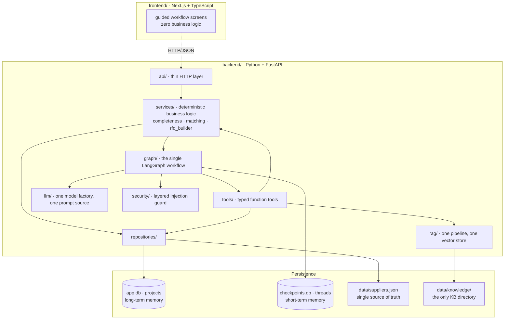
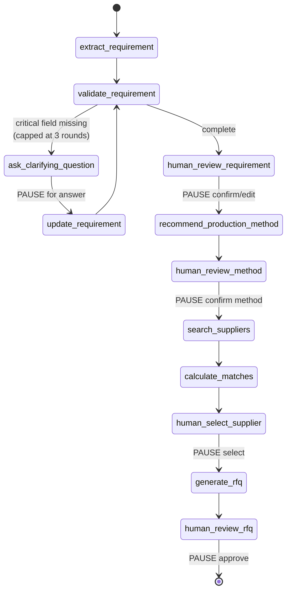

# Produce Your Stuff

**AI-powered B2B sourcing and production orchestration.** You already have the product and the design — describe what you want customised, and Produce Your Stuff works out *how* it can be made and *who* can make it.

> **Status: complete.** The whole product runs end to end in a browser: natural language → typed brief → clarification → *knowledge-grounded* method recommendation → deterministic supplier matching → RFQ, with four human approval gates, layered prompt-injection defence and validated uploads — see [Implementation status](#implementation-status). This README describes only what actually exists; the full approved design lives in [docs/architecture.md](docs/architecture.md).

---

## Problem

A Berlin SME with 100 black yoga mats and a gold logo currently has to work out which customisation technique is even appropriate, find production partners, discover whether any of them accept customer-owned goods, check minimum order quantities, compare capabilities, and then re-explain the same project to every supplier by hand. It is days of undifferentiated work before a single quote arrives.

## Solution

```
PRODUCT + DESIGN
      ↓  natural language, one box
AI understands the requirement      → typed Production Brief
      ↓  asks only what is genuinely missing
technical production recommendation → RAG-backed, with explicit uncertainty
      ↓  human confirms
qualified supplier matching         → deterministic score, AI only explains it
      ↓  human selects
production-ready RFQ                → human edits and approves
```

**The core promise:** describe what you want to customise; Produce Your Stuff figures out how and who can produce it.

**Target user:** Berlin SMEs, startups, creators and agencies needing a relatively small batch of customised physical products — branded yoga mats, engraved bottles, embroidered textiles, packaging, event merch, corporate gifts.

**Supported techniques:** laser engraving · printing (screen / digital / pad / heat-transfer foil) · embroidery · labels & packaging.

---

## Two principles that shape the whole codebase

**1. AI recommends, humans decide.** Four explicit approval gates — the Production Brief, the production method, the supplier, and the final RFQ. Nothing is ordered, sent, or committed autonomously. No supplier is ever contacted by this system.

**2. The LLM never invents facts.** Supplier capabilities come only from `backend/data/suppliers.json` via typed tools. Match scores are computed in plain Python; the model receives the finished breakdown and may only phrase it. Unknown values stay `null` — an unconfirmed capability is not the same as a missing one, and the scorer treats them differently.

---

## Quickstart

**Prerequisites:** Python ≥3.12 (3.14 verified), [uv](https://docs.astral.sh/uv/), Node ≥20 (frontend, Phase 5).

```bash
cp .env.example .env
```

Add your API key to `.env`. It is read by exactly one module (`app/config.py`), stored as a `SecretStr`, never logged, and never exposed to the frontend.

**Provider.** The key may be an OpenAI key or an **OpenRouter** key — OpenRouter speaks the OpenAI API, including strict JSON-schema structured outputs and embeddings, so only the base URL differs. The default configuration targets OpenRouter with `openai/gpt-4o` (reasoning) and `openai/gpt-4o-mini` (routing and explanations). To use OpenAI directly, set `PYS_OPENAI_BASE_URL=` (empty) and drop the `openai/` prefix from the model names; no code changes.

`PYS_LLM_MAX_TOKENS` defaults to 1024 and is deliberately explicit: the client library otherwise reserves the model's full output window, and gateways gate on that up front — OpenRouter returns HTTP 402 for a request that would actually have cost a few hundred tokens.

> **Troubleshooting `ProductionRequirement generation failed`.** This means the model provider refused the request. On OpenRouter's free tier it is almost always a `402`: the remaining balance no longer affords even the reserved token budget, and the affordable ceiling keeps shrinking as credit drains. Confirm from the backend log, then either add credits or set `PYS_MODEL_NAME=openai/gpt-4o-mini` — far cheaper, and it extracts correctly. The workflow handles the failure cleanly either way: nothing is committed, no partner is contacted, and the project records the error rather than crashing.

```bash
cd backend && uv sync
```

Run the API:

```bash
cd backend && uv run python -m uvicorn app.main:app --reload --port 8000
```

Then check readiness at http://localhost:8000/api/health (interactive docs at `/docs`).

Run the frontend, in a second terminal:

```bash
cd frontend && npm install && npm run dev
```

Open http://localhost:3000. The frontend reads `API_BASE_URL` (see `frontend/.env.local.example`); the default points at port 8000, so no configuration is needed for local use.

> **Windows note:** use `uv run python -m uvicorn`, not `uv run uvicorn`. Windows Application Control blocks the generated `uvicorn.exe` shim in the virtualenv (`os error 4551`); invoking the module directly avoids it. This was verified on this machine.

### Verification commands

```bash
cd backend && uv run pytest
```

```bash
cd backend && uv run ruff check . && uv run ruff format --check . && uv run mypy app tests scripts
```

```bash
cd backend && uv run python scripts/audit_architecture.py
```

That last one is the guard rail against this project's predecessor: it fails the build if a second LangGraph, prompt module, LLM factory, vector store, knowledge directory or supplier data source appears, or if any module under `app/` becomes unreferenced dead code.

### The live demo

The test suite runs entirely on a scripted provider — no key, no network, no cost. One script exercises the real model:

```bash
cd backend && uv run python scripts/demo_run.py
```

It drives the §20 demo scenario ("I have 100 black yoga mats…") through every stage and prints the brief, the recommendation, the scored matches with their factor breakdown, and the generated RFQ. Every human gate is auto-approved so the run is unattended. **Nothing is sent to any supplier** — the RFQ is printed and discarded.

---

## Architecture



**Import direction is one-way and enforced:** `api → services → {graph, repositories}`, `graph → {tools, llm, services, security}`, `tools → {services, rag, repositories}`. Nothing imports upward, `graph/` never imports `api/`, and `services/matching.py` imports no LLM code at all (audited). This is what makes the frontend replaceable without touching the agent.

### Agent vs. deterministic code

| Concern | Owner | Why |
|---|---|---|
| Requirement extraction | LLM (structured output) | natural language → typed object |
| Completeness check | **Python** | "which fields are null" is not a judgement call |
| Method recommendation | LLM + RAG | genuine technical reasoning, with cited sources |
| Supplier search | **Python** | structural filter; results must not depend on phrasing |
| Match scoring | **Python** | must be reproducible and defensible |
| Match explanation | LLM | prose only, over a score it cannot change |
| RFQ structure | **Python** | document shape is a contract, not a generation |
| RFQ prose | LLM | intro and closing only |

---

## The workflow

One LangGraph, five human interrupts. `scripts/audit_architecture.py` fails the build if a second `StateGraph` ever appears.



**Human-in-the-loop is structural, not decorative.** The graph physically cannot pass a gate without a resume payload, and `RFQ.approved` is set only by an explicit approve action — declining ends the run without a completed project. Every decision is written to `project_events` with `actor='human'`.

**Memory.** Two stores, deliberately separate. LangGraph's SQLite checkpointer holds conversation state (short-term); the `projects` table holds the durable business record (long-term). A project survives a process restart because the record is ours and does not depend on a checkpoint format we do not own.

**Error handling.** A model failure never propagates as an exception. It is logged, recorded in `errors`, and the stage becomes `FAILED` so the graph routes to a controlled stop — the client gets a typed error, never a stack trace. Failures that only affect prose degrade instead: if the match-explanation call fails, matches still render with their Python-generated per-factor reasons.

### Tools

`search_suppliers` · `get_supplier_capabilities` · `calculate_supplier_matches` · `resolve_supplier`, all with typed schemas in `app/tools/registry.py`. Note what is *absent*: scoring is not a tool the model can influence. It is called by a node with data the model never touches.

---

## Agentic RAG

One knowledge directory, one pipeline, one index. `scripts/audit_architecture.py` fails the build if a second appears — the predecessor project had two knowledge directories and FAISS entry points in two modules, so retrieval behaved differently depending on which code path you hit.

**The corpus.** 13 curated documents in `backend/data/knowledge/`, each with YAML frontmatter (`title`, `production_method`, `materials`, `source`, `source_url`, `updated_at`): laser engraving and its material limits, the PVC safety refusal, screen/digital/pad printing, heat transfer and foil, embroidery, labels, packaging, material compatibility, artwork requirements, production limitations. Cross-cutting references carry `production_method: null` rather than a fabricated method.

These are **internally authored notes**, labelled as such in every `source` field, with `source_url: null` throughout — no citation points at a document this project has not written. Technical claims are general trade knowledge, and the recommendation surfaces `confidence` and `open_questions` so nothing reads as a guarantee.

**The pipeline.** `load → markdown-header split → size split (800/120) → embed → FAISS → data/index/`. FAISS is used directly rather than through a framework wrapper: fewer dependencies, and persistence is a plain index file plus JSON instead of a pickle — a pickled index is arbitrary code execution waiting for someone to swap the file. The index self-heals: a fingerprint over document bytes plus the embedding model name means editing a document or switching model forces a rebuild rather than silently searching a stale corpus.

**What makes it agentic.** Retrieval does not fire on every request. Routing is layered, cheapest first:

| Layer | Decides |
|---|---|
| Deterministic fast path | *"Which suppliers in Berlin support laser engraving?"* → supplier repository, **no model call**. *"Is laser engraving appropriate for anodised aluminium?"* → retrieve, **no model call**. |
| Deterministic rule on the brief | Material unconfirmed → retrieve, because feasibility genuinely cannot be assumed. |
| The model | Everything genuinely ambiguous — is this pairing routine enough to answer from general knowledge? |

If the router itself fails, it errs toward retrieving: an unnecessary lookup is cheap, a confident wrong technical claim is not.

**It demonstrably changes the answer.** The same demo request, with and without retrieval:

| | Without retrieval | Grounded |
|---|---|---|
| confidence | medium | high |
| constraints | 1, generic | 4, including the corpus's "1 to 2 mm line thickness for weeded vinyl" |
| open questions | "type of gold finish" | "the specific PVC compound, as this affects temperature settings" |

`retrieval_used` and `sources` are set **in code from what was actually retrieved**, never asserted by the model — a recommendation made without sources cannot claim any.

**Trust boundary.** Retrieved passages are untrusted input, exactly like customer text: screened, then fenced as `<untrusted_knowledge_excerpts>` in a *user* message, never the system prompt. A retrieval outage costs confidence in the recommendation, not the project — the workflow continues with no knowledge rather than failing.

Build the index explicitly (it also builds lazily on first use):

```bash
cd backend && uv run python scripts/build_index.py
```

---

## HTTP API

Five paths, six operations. Only one of them advances the workflow.

| Method | Path | Purpose |
|---|---|---|
| `GET` | `/api/health` | liveness + readiness booleans (no secrets) |
| `POST` | `/api/projects` | create, run to the first human gate |
| `GET` | `/api/projects` | dashboard list |
| `GET` | `/api/projects/{id}` | full current state — the "leave and come back" endpoint |
| `POST` | `/api/projects/{id}/resume` | answer whichever gate the workflow is paused at |
| `POST` | `/api/uploads` | validated design file, metadata only |

`resume` takes a discriminated action: `answer_clarification`, `confirm_brief`, `edit_brief`, `confirm_method`, `select_supplier`, `approve_rfq`, `edit_rfq`. One endpoint rather than seven, **because the graph is the authority on where it is** — a client cannot talk it into skipping a human approval by calling a different path. A mismatched action gets `409` naming the action actually expected, so a stale browser tab receives a correctable answer instead of silently resuming the wrong branch.

Every error uses one envelope — `{error: {code, message, stage, recoverable}}` — so the frontend needs exactly one error path. Stack traces and raw model output never cross the boundary.

Interactive docs at `/docs` once the server is running.

---

## Security

Not regex-only. The predecessor project's pattern list was the criticism, and the criticism was right: patterns are defeated by spacing, homoglyphs, zero-width characters or base64, and they produce a boolean where a judgement is needed.

**Five layers, and the two that matter most are not detection at all.**

| # | Layer | What it does |
|---|---|---|
| 1 | Normalisation | NFKC, strip invisible and bidi-control characters, fold Cyrillic/Greek homoglyphs, decode base64 blocks for inspection, cap length |
| 2 | Heuristic signals | Weighted evidence → a **score**, never a verdict. Individually weak signals accumulate |
| 3 | Model classifier | Consulted only above a threshold, so cost falls on suspicious input rather than every request |
| 4 | **Structure** | Untrusted content never enters a system message, and fence tokens inside it are neutralised so it cannot escape its own delimiters |
| 5 | **Output validation** | Every model response is a closed Pydantic schema, so a successful injection still cannot produce a field the system acts on |

Layers 4 and 5 are the ones that must hold. There is a test that disables screening entirely and proves an attack still cannot become an instruction.

**Policy differs by provenance, deliberately.** Customer text is the *subject of analysis*: a brief saying "please ignore the scratches on two of them" must not be rejected, because blocking real work is a worse failure than reading a hostile string that structure already contains. So customer text is logged, never blocked. Uploaded files fail closed. Our own curated knowledge base fails open — it should not be able to take itself offline.

**One thing worth knowing:** an upstream content-policy refusal is treated as *evidence*, not an outage. In practice the most blatant injections are rejected by the provider's own filter rather than classified, so discarding that response would throw away the strongest available signal.

**Uploads.** Extension allowlist ∩ sniffed magic bytes — the name and the content must agree, which is what stops a PDF arriving as `logo.png`. PNG, JPEG and PDF only; **SVG is refused** because it is XML that can carry script. Max 5 MB, stored under a generated name so a crafted filename cannot traverse directories, and nothing parses, renders or executes the body. In this phase only metadata reaches the agent.

**Secrets.** `config.py` alone reads the environment; the key is a `SecretStr`; `.env` is gitignored; the frontend has no model access. No chain-of-thought is exposed — responses carry conclusions and structured `rationale`/`open_questions` fields, never raw reasoning.

---

## Frontend

Next.js App Router, TypeScript, Tailwind. Six screens: dashboard, new project, clarification, production brief, method recommendation, partner matches, RFQ review.

**The client holds no business logic.** It receives `{stage, payload, expected_action}` and switches on `stage`. It does not know which step follows which, when a clarification is needed, what makes a brief complete, or how a score is calculated — all of that is server-side, and duplicating any of it here would create a second source of truth that could drift. The entire client-side "workflow logic" is one `switch` on a value the server produced.

**The browser never talks to FastAPI.** Reads happen in server components, writes go through server actions. So the API base URL stays server-side, no credentials reach the client, and CORS is a non-problem rather than a configuration.

**Design.** Warm neutrals, near-black primary, and colour reserved strictly for meaning — a verdict, a risk, a status. Nothing is coloured for decoration. Committed to a single light theme on purpose: a half-considered dark mode reads worse than a confident light one. Responsive, and verified at 375px.

Three things the UI is deliberate about:

- **Unknown values render as "Not specified", never as blank.** An honest gap is information the user needs before approving.
- **The score breakdown is on the page, not behind a tooltip.** "Why 92%?" is the question that decides whether a buyer trusts the number. The AI paragraph beside it is labelled as unable to change the score.
- **Uncertainty is as prominent as the recommendation.** Confidence, open questions and whether the knowledge base was consulted all appear on the method screen.

Verification:

```bash
cd frontend && npm run typecheck && npm test && npm run build
```

Frontend tests cover the one place the client has real logic — translating the API error envelope — and deliberately nothing about scoring or stage order, since that would be testing a copy of the server's rules.

---

## Repository layout

```
backend/
  app/
    config.py            # the only module that reads the environment
    logging_config.py    # the only logging configuration
    api/                 # HTTP boundary (routes + wire DTOs)
    domain/              # Pydantic contracts: requirement, supplier, matching,
                         #   method, knowledge, rfq, project
    llm/
      factory.py         # the only ChatOpenAI construction
      prompts.py         # the only prompt text in the codebase
    graph/
      state.py           # ProductionState + checkpointed type allowlist
      nodes.py           # thin nodes; 5 interrupts
      workflow.py        # THE single StateGraph
    tools/registry.py    # typed function tools over the services
    services/
      completeness.py    # deterministic missing-field logic
      matching.py        # deterministic scorer (no LLM imports)
      rfq_builder.py     # deterministic RFQ assembly
      project_service.py # graph pause/resume + persistence
    rag/
      store.py           # THE vector store: load, chunk, embed, index, search
      retriever.py       # retrieval + the routing decision
    repositories/        # SQLite + supplier data access
    security/
      guard.py           # layered injection screening
      uploads.py         # magic-byte validation, inert storage
  data/
    suppliers.json       # 24 curated records — single source of truth
    knowledge/           # 13 curated documents - the only KB directory
    index/               # generated FAISS index (gitignored, rebuildable)
  scripts/
    audit_architecture.py
    build_index.py       # thin entry point to the one builder
    demo_run.py          # the only code that calls a real model
  tests/
frontend/
  app/                   # dashboard, new project, workflow shell
  components/
    ui.tsx               # presentation primitives
    workflow/            # one component per gate
  lib/
    api.ts               # the only contact with the backend
    actions.ts           # server actions
    types.ts             # mirrors backend/app/api/dto.py
  tests/
docs/architecture.md     # the approved design
```

### Supplier data

24 records covering all eight production methods across 14 cities in 5 countries. **The dataset is synthetic** and labelled as such: every record carries `data_source: "synthetic"`, `website` is `null` on all of them so no entry points at a real company, and the file's `_provenance` block says so in the data itself. Capabilities are illustrative and do not describe real businesses. Real, source-backed partners replace this file later; the schema does not change.

The dataset deliberately exercises every branch of the matching algorithm: suppliers that refuse customer-owned goods, suppliers whose policy is *unconfirmed* (`null`), MOQs above and below the demo quantity, unknown lead times, and method/category mismatches.

---

## Supplier matching

Pure Python in `backend/app/services/matching.py`. No randomness, no clock reads
— "today" is a parameter — and **no LLM import at all**, which the architecture
audit enforces. Identical inputs produce byte-identical output, tie order
included.

### Hard gates

Structural impossibilities. These produce `eligible: false` and are reported
separately with a reason, never ranked into the top matches:

1. The confirmed method is not in `supported_methods`.
2. `customer_owns_product` is true and the partner explicitly refuses external
   goods.
3. The product category is not in `product_categories`.

A partner that cannot perform the technique must not surface because it happens
to be nearby and cheap. In the demo, `syn-005` is in Berlin, handles PVC, accepts
customer goods and serves sports equipment — and is excluded on the technique
alone.

### Weighted factors, 100 points

| Factor | Points | Full | Partial | Zero |
|---|---|---|---|---|
| Method compatibility | 30 | supported | — | *(hard gate)* |
| Material compatibility | 20 | in the published list | 10 — material or list unknown ⚠ | not listed |
| MOQ / quantity | 15 | `moq ≤ qty ≤ max` | 7.5 — limits unpublished ⚠ | outside the bounds ⚠ |
| Accepts customer-owned | 15 | explicit yes, or N/A | 7.5 — unconfirmed ⚠ | *(hard gate)* |
| Deadline feasibility | 10 | `lead time + 5d buffer` fits | 5 — lead time unknown, or ≤20% over ⚠ | clearly infeasible ⚠ |
| Location | 10 | same city | 6 same country · 3 same region or unknown ⚠ | outside |

### Unknown is not No

The distinction the whole design turns on. A partner whose customer-goods policy
is `null` has *not been asked* — that scores 7.5 with a visible risk flag. A
partner that has explicitly refused scores nothing and is gated out. Conflating
the two would either hide a real blocker or discard a viable partner, and it is
why the dataset stores `null` rather than defaulting to `false`.

### Ties

`(-score, not verified, lead_time ?? 9999, id)` — a total order. The trailing
`id` is what makes it total: without it two otherwise identical partners could
swap places between runs.

### What the model does

It receives the finished breakdown and writes one paragraph of prose. It cannot
produce, adjust or re-weight a score, and the UI says so beside the text. If that
call fails, matches still render with their Python-generated per-factor reasons —
degraded prose, not a broken feature.

---

## Observability

One logging configuration, JSON by default (`PYS_LOG_FORMAT=console` for local reading). Every module uses `logging.getLogger(__name__)`. Event names are a closed enum (`app/logging_config.py`), so logs stay greppable: `project_created`, `requirement_extraction_started/completed`, `clarification_requested`, `rag_called/completed`, `supplier_search_started`, `supplier_candidates_found`, `supplier_matching_completed`, `rfq_generated`, `injection_suspected`, `llm_error`, `tool_error`, and others.

**Never logged:** API keys (`SecretStr`), or full user text. Request text is recorded as length + SHA-256 prefix + a 200-character preview via `redact_text()`.

---

## Implementation status

| Phase | Scope | State |
|---|---|---|
| 0 | Foundations: pinned deps, config, logging, domain contracts, supplier dataset, API boot | **complete** |
| 1 | Deterministic core: completeness, matching scorer, RFQ builder, repositories | **complete** |
| 2 | Agent core: LLM factory, prompts, the single LangGraph with 5 interrupts, project service | **complete** |
| 3 | Agentic RAG: knowledge base, vector store, retrieval router | **complete** |
| 4 | Security guard + full HTTP API surface | **complete** |
| 5 | Next.js frontend: six screens over the pinned API contract | **complete** |
| 6 | Documentation and final verification | **complete** |

All six phases are complete. The design, and every place the build knowingly departed from it, is recorded in [docs/architecture.md](docs/architecture.md).

---

## Demo walkthrough

The scenario the product was built around. Start both servers, open
http://localhost:3000, and paste:

> I have 100 black yoga mats. I already own them. I want my gold logo added and
> need them in Berlin by September 15.

Note what is *not* in that sentence: the material. Watch what happens.

**1 · Extraction.** Product, quantity, ownership, finish, deadline and location
come out as typed fields. Material stays `null`, because the request never said
it — a yoga mat does not imply PVC.

**2 · Clarification.** The deterministic completeness check sees the gap and the
workflow stops:

> *What material are the yoga mats made of?*
> Material decides whether a technique is technically feasible on this product.

One question, about one field, chosen in code. Answer `They are PVC mats.`

**3 · Production brief.** The answer is merged — fill-only, so it cannot
overwrite anything you already said. Fields you never mentioned still read
"Not specified". Confirm, or edit first.

**4 · Method.** The router decides retrieval is needed (a metallic finish on a
flexible synthetic is not a routine pairing) and grounds the recommendation in
the knowledge base:

```
Heat transfer                          alternative: Screen printing
High confidence

  PVC can soften, gloss, shrink or emboss under heat, so temperature must be
  carefully controlled.
  Textured surfaces may give a patchy finish — foil needs contact.
  Fine detail limited to 1–2 mm line thickness.

Still unverified
  Exact texture of the mat surface.
  The specific PVC compound, as it influences heat settings.

Grounding — based on 2 production knowledge documents:
  PVC must not be laser cut or engraved
  Heat transfer and metallic foil application
```

The first citation is the interesting one. Ask for *engraving* on these mats and
the same corpus explains why no reputable shop will do it — PVC releases
hydrogen chloride under a laser. That is the knowledge base earning its place: a
model working from recall might cheerfully suggest engraving.

**5 · Partner matches.** Scores computed in Python from stored capabilities:

```
100%  Neukoelln Foil and Finish     ✓ all six factors confirmed
 96%  Mattenveredelung Brandenburg  ~ in DE but not in Berlin (6/10)
 88%  Spandau Sport Finishing       ⚠ customer-goods policy unconfirmed
                                    ⚠ timeline tight: ~25 days needed, 23 available
```

Open "Why this score?" on any of them for the full factor breakdown. 17 of 24
partners were excluded, each with a reason — including one that is in Berlin,
handles PVC, accepts customer goods and serves sports equipment, and fails only
because it does not offer the technique.

**6 · RFQ.** Nine questions the partner actually needs to answer, including
acceptance of customer-owned goods. Generated unapproved. Edit or approve — and
approving records your decision without sending anything to anyone.

For the same journey in a terminal, against the real model:

```bash
cd backend && uv run python scripts/demo_run.py
```

---

## How this maps to the sprint requirements

Each row names the test that proves it, so nothing here is a claim you have to
take on trust.

| Requirement | Where | Test |
|---|---|---|
| AI agent + LangGraph | one `StateGraph`, thin nodes | `test_graph.py` |
| State management | `ProductionState` + SQLite checkpointer | `test_state_survives_a_fresh_checkpointer_connection` |
| OpenAI API | one factory, structured outputs only | `test_graph.py`, `scripts/demo_run.py` |
| Prompt engineering | one prompt module, fenced untrusted data | `test_untrusted_request_is_fenced_into_a_user_message` |
| Function tools | typed `ProductionTools` | `test_matching.py`, `test_rag.py` |
| Error handling | controlled failure, typed envelope | `test_provider_outage_returns_a_controlled_error` |
| User interface | six Next.js screens | `frontend/tests`, browser-verified |
| Documentation | this file + `docs/architecture.md` | — |
| **Memory (medium)** | short-term checkpointer + long-term `projects` table | `test_confirmed_state_survives_a_reconnect` |
| **Security (medium)** | five-layer injection defence, upload validation | `test_security.py` (32 tests) |
| **Agentic RAG (hard)** | routing that demonstrably varies | `test_technical_question_routes_to_the_knowledge_base`, `test_supplier_lookup_does_not_route_to_the_knowledge_base` |
| Human-in-the-loop | four gates, enforced by `interrupt()` | `test_workflow_stops_at_all_four_approval_gates` |
| Structured logging | one config, closed event enum | `test_log_events_are_a_closed_set` |

**213 backend tests, 6 frontend tests.** No test calls a live model: the graph
runs on a scripted provider and retrieval on a hashing embedder whose similarity
is real term overlap, so the suite is free, fast and deterministic. Live
behaviour is verified separately by `scripts/demo_run.py`.

---

## Known limitations

Stated plainly, because a reviewer will find them anyway.

**The supplier data is synthetic.** 24 curated records, labelled as such in every
row. The matching algorithm is real; the partners are not. Real data is the first
thing to swap, and the schema does not change when you do.

**The knowledge base is internally authored.** 13 documents, `source_url: null`
throughout, so no citation points at a document this project did not write. The
technical content is general trade knowledge and the UI shows confidence and open
questions — but it is not a substitute for a vendor's own datasheet.

**No authentication.** Projects are addressable by UUID and anyone with the URL
can act on them. Fine for a single-tenant local build, not for deployment.

**Design uploads are validated and stored, not understood.** There is no image
analysis, so artwork is never checked against the recommended method. The upload
endpoint exists and is safe; it just does not read the file.

**The clarification loop asks one question at a time, up to three.** After that
it proceeds with gaps visible rather than pressing further, which is honest but
can leave a thinner brief than the user intended.

**Matching is single-currency and price-blind.** No partner in the dataset
carries pricing, so the score says nothing about cost. `priority: cost` is
captured and passed to the RFQ but does not influence ranking.

**Location scoring is city/country/region tiers, not distance.** A partner across
a national border 40 km away scores below one 600 km away in the same country.
Deliberate — it avoids a network dependency — but it is a simplification.

**Deadline feasibility uses the partner's own typical lead time.** No capacity or
seasonality model. Two projects racing for the same partner's Q3 slot both look
feasible.

**No streaming.** Each step is a synchronous request. A method recommendation
takes a few seconds with no token-by-token feedback, only a pending state.

**Single light theme.** No dark mode.

---

## Roadmap

Ordered by what would most change the product's usefulness, not by ease.

**Real partner data.** Replace `suppliers.json` with verified Berlin partners,
each field sourced. The `verified` flag and `data_source` already exist for the
distinction. This is what turns a working prototype into something a buyer can
act on.

**Send the RFQ.** The document is complete and human-approved; nothing transmits
it. Real outbound email, per-partner threading, and reply capture is the next
whole feature — and the point at which "AI recommends, human decides" needs
auditing much more carefully than it does now.

**Quote comparison.** Once replies exist, the interesting product problem is
normalising incomparable quotes: setup versus unit cost, MOQ tiers, sample fees.

**Accounts and multi-tenancy.** Required before anyone but you can use it.

**Price-aware matching.** Add cost bands to the partner schema and make
`priority` actually influence ranking.

**Artwork checking.** Read the uploaded file and check it against the
recommended method's artwork requirements — minimum line weight for weeded
vinyl, vector-versus-raster, colour space. The requirements are already
articulated per method; nothing yet reads the file.

**Evaluation harness.** A fixed set of briefs with expected extractions and
routing decisions, scored on every change. The suite proves the mechanism works;
it does not measure whether recommendation quality improves or regresses.

**Observability.** LangSmith or Langfuse tracing, plus token and cost display.
The structured logs carry the events; nothing aggregates them.

---

## Deliberately not built

Payments, checkout, authentication, supplier accounts or portal, real email or supplier contact, logistics, ERP, ordering, a design editor, complex image AI, multi-model support, and a multi-agent architecture. These are out of MVP scope by decision, not omission.
