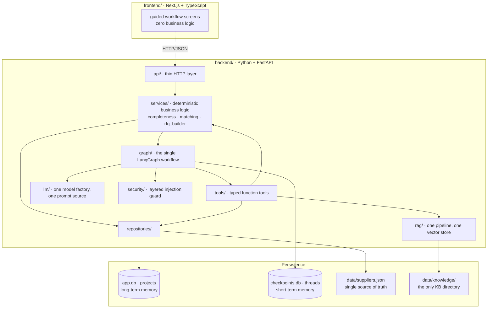

# Produce Your Stuff

**AI-powered B2B sourcing and production orchestration.** You already have the product and the design — describe what you want customised, and Produce Your Stuff works out *how* it can be made and *who* can make it.

> **Status: Phase 0 complete** (foundations). The backend boots, contracts and the supplier dataset are in place and verified. The LangGraph workflow, RAG and frontend land in Phases 2–5 — see [Implementation status](#implementation-status). This README describes only what actually exists; the full approved design lives in [docs/architecture.md](docs/architecture.md).

---

## Problem

A Berlin SME with 100 black yoga mats and a gold logo currently has to work out which customisation technique is even appropriate, find production partners, discover whether any of them accept customer-owned goods, check minimum order quantities, compare capabilities, and then re-explain the same project to every supplier by hand. It is days of undifferentiated work before a single quote arrives.

## Solution

```
PRODUCT + DESIGN
      ↓  natural language, one box
AI understands the requirement      → typed Production Brief
      ↓  asks only what is genuinely missing
technical production recommendation → RAG-backed, with explicit uncertainty
      ↓  human confirms
qualified supplier matching         → deterministic score, AI only explains it
      ↓  human selects
production-ready RFQ                → human edits and approves
```

**The core promise:** describe what you want to customise; Produce Your Stuff figures out how and who can produce it.

**Target user:** Berlin SMEs, startups, creators and agencies needing a relatively small batch of customised physical products — branded yoga mats, engraved bottles, embroidered textiles, packaging, event merch, corporate gifts.

**Supported techniques:** laser engraving · printing (screen / digital / pad / heat-transfer foil) · embroidery · labels & packaging.

---

## Two principles that shape the whole codebase

**1. AI recommends, humans decide.** Four explicit approval gates — the Production Brief, the production method, the supplier, and the final RFQ. Nothing is ordered, sent, or committed autonomously. No supplier is ever contacted by this system.

**2. The LLM never invents facts.** Supplier capabilities come only from `backend/data/suppliers.json` via typed tools. Match scores are computed in plain Python; the model receives the finished breakdown and may only phrase it. Unknown values stay `null` — an unconfirmed capability is not the same as a missing one, and the scorer treats them differently.

---

## Quickstart

**Prerequisites:** Python ≥3.12 (3.14 verified), [uv](https://docs.astral.sh/uv/), Node ≥20 (frontend, Phase 5).

```bash
cp .env.example .env
```

Add your `OPENAI_API_KEY` to `.env`. It is read by exactly one module (`app/config.py`), stored as a `SecretStr`, never logged, and never exposed to the frontend.

```bash
cd backend && uv sync
```

Run the API:

```bash
cd backend && uv run python -m uvicorn app.main:app --reload --port 8000
```

Then check readiness at http://localhost:8000/api/health (interactive docs at `/docs`).

> **Windows note:** use `uv run python -m uvicorn`, not `uv run uvicorn`. Windows Application Control blocks the generated `uvicorn.exe` shim in the virtualenv (`os error 4551`); invoking the module directly avoids it. This was verified on this machine.

### Verification commands

```bash
cd backend && uv run pytest
```

```bash
cd backend && uv run ruff check . && uv run ruff format --check . && uv run mypy app tests scripts
```

```bash
cd backend && uv run python scripts/audit_architecture.py
```

That last one is the guard rail against this project's predecessor: it fails the build if a second LangGraph, prompt module, LLM factory, vector store, knowledge directory or supplier data source appears, or if any module under `app/` becomes unreferenced dead code.

---

## Architecture



**Import direction is one-way and enforced:** `api → services → {graph, repositories}`, `graph → {tools, llm, services, security}`, `tools → {services, rag, repositories}`. Nothing imports upward, `graph/` never imports `api/`, and `services/matching.py` imports no LLM code at all (audited). This is what makes the frontend replaceable without touching the agent.

### Agent vs. deterministic code

| Concern | Owner | Why |
|---|---|---|
| Requirement extraction | LLM (structured output) | natural language → typed object |
| Completeness check | **Python** | "which fields are null" is not a judgement call |
| Method recommendation | LLM + RAG | genuine technical reasoning, with cited sources |
| Supplier search | **Python** | structural filter; results must not depend on phrasing |
| Match scoring | **Python** | must be reproducible and defensible |
| Match explanation | LLM | prose only, over a score it cannot change |
| RFQ structure | **Python** | document shape is a contract, not a generation |
| RFQ prose | LLM | intro and closing only |

---

## Repository layout

```
backend/
  app/
    config.py            # the only module that reads the environment
    logging_config.py    # the only logging configuration
    api/                 # HTTP boundary (routes + wire DTOs)
    domain/              # Pydantic contracts: requirement, supplier, matching,
                         #   method, knowledge, rfq, project
    llm/                 # one model factory, one prompt source     [Phase 2]
    graph/               # the single LangGraph workflow            [Phase 2]
    tools/               # typed function tools                     [Phase 2]
    services/            # deterministic business logic             [Phase 1]
    rag/                 # one pipeline, one vector store           [Phase 3]
    repositories/        # SQLite + supplier data access            [Phase 1]
    security/            # layered prompt-injection guard           [Phase 4]
  data/
    suppliers.json       # 24 curated records — single source of truth
    knowledge/           # the only knowledge-base directory        [Phase 3]
  scripts/
    audit_architecture.py
  tests/
frontend/                # Next.js app                             [Phase 5]
docs/architecture.md     # the approved design
```

### Supplier data

24 records covering all eight production methods across 14 cities in 5 countries. **The dataset is synthetic** and labelled as such: every record carries `data_source: "synthetic"`, `website` is `null` on all of them so no entry points at a real company, and the file's `_provenance` block says so in the data itself. Capabilities are illustrative and do not describe real businesses. Real, source-backed partners replace this file later; the schema does not change.

The dataset deliberately exercises every branch of the matching algorithm: suppliers that refuse customer-owned goods, suppliers whose policy is *unconfirmed* (`null`), MOQs above and below the demo quantity, unknown lead times, and method/category mismatches.

---

## Observability

One logging configuration, JSON by default (`PYS_LOG_FORMAT=console` for local reading). Every module uses `logging.getLogger(__name__)`. Event names are a closed enum (`app/logging_config.py`), so logs stay greppable: `project_created`, `requirement_extraction_started/completed`, `clarification_requested`, `rag_called/completed`, `supplier_search_started`, `supplier_candidates_found`, `supplier_matching_completed`, `rfq_generated`, `injection_suspected`, `llm_error`, `tool_error`, and others.

**Never logged:** API keys (`SecretStr`), or full user text. Request text is recorded as length + SHA-256 prefix + a 200-character preview via `redact_text()`.

---

## Implementation status

| Phase | Scope | State |
|---|---|---|
| 0 | Foundations: pinned deps, config, logging, domain contracts, supplier dataset, API boot | **complete** |
| 1 | Deterministic core: completeness, matching scorer, RFQ builder, repositories | next |
| 2 | Agent core: LLM factory, prompts, the single LangGraph with 5 interrupts | planned |
| 3 | Agentic RAG: knowledge base, vector store, retrieval router | planned |
| 4 | Security guard + full API surface | planned |
| 5 | Next.js frontend | planned |
| 6 | Documentation and final verification | planned |

Sections still to be written here, as the code that justifies them lands: LangGraph node diagram, tool catalogue, memory model, RAG design, the security layers, the full matching algorithm, the demo walkthrough, known limitations and roadmap. The design for all of it is already fixed in [docs/architecture.md](docs/architecture.md).

## Deliberately not built

Payments, checkout, authentication, supplier accounts or portal, real email or supplier contact, logistics, ERP, ordering, a design editor, complex image AI, multi-model support, and a multi-agent architecture. These are out of MVP scope by decision, not omission.
