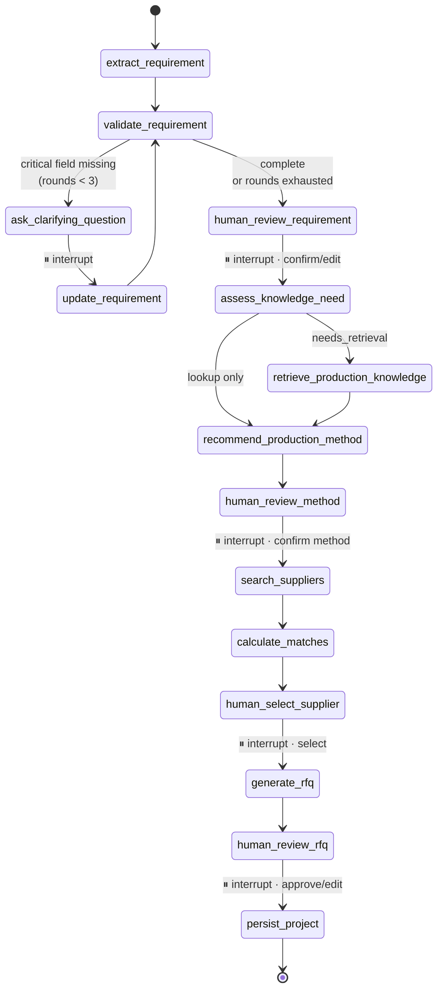

# Produce Your Stuff — Architecture

Approved design, 21 August 2026. This is the reference document; the README describes only what is implemented. Where the two disagree, this file states the intent and the README states reality.

## Design rules

Five rules, derived from what went wrong in the predecessor project (duplicate RAG pipelines, two knowledge directories, competing retrievers, dead agent code, regex-only injection defence, no logging, unpinned dependencies).

1. **Strict one-way imports.** `api → services → {graph, repositories}`; `graph → {tools, llm, services, security}`; `tools → {services, rag, repositories}`. Nothing imports upward. `graph/` never imports `api/`. `services/matching.py` imports no LLM code.
2. **The frontend is a dumb renderer.** It receives `{stage, payload}` and renders it. No scoring, no field-requirement rules, no prompt text. Replaceable without touching Python.
3. **Deterministic logic lives in `services/`** — not in graph nodes, and never inside a prompt. Nodes are thin: read state, call a service or the LLM, return a state delta.
4. **Two memories, deliberately separate.** LangGraph's checkpointer holds conversation/thread state; the `projects` table holds the durable business record. Mixing them makes "leave and come back" depend on a checkpoint format we do not own.
5. **Singletons by construction.** One LLM factory, one prompt module, one `StateGraph`, one vector store, one knowledge directory, one supplier file. A new implementation *replaces* the old one — it never sits beside it. Enforced by `scripts/audit_architecture.py`.

## The workflow

| Node | Kind |
|---|---|
| `extract_requirement` | LLM, structured output → `ProductionRequirement`; unknowns stay `null` |
| `validate_requirement` | deterministic (`services/completeness.py`), pure function |
| `ask_clarifying_question` | LLM + **interrupt**; one question, from the missing-field list |
| `update_requirement` | LLM; merges the answer, may only fill gaps (`ProductionRequirement.merge`) |
| `human_review_requirement` | **interrupt**; confirm or submit an edited requirement |
| `assess_knowledge_need` | LLM router → `RetrievalDecision`. The agentic part of RAG |
| `retrieve_production_knowledge` | tool; guarded, cited snippets |
| `recommend_production_method` | LLM → `MethodRecommendation` with `open_questions` + `confidence` |
| `human_review_method` | **interrupt**; method confirmed before any supplier work |
| `search_suppliers` | deterministic repository query, no LLM |
| `calculate_matches` | deterministic scorer; LLM writes `ai_explanation` only |
| `human_select_supplier` | **interrupt**; user picks from the top 3 |
| `generate_rfq` | deterministic builder; LLM polishes `intro`/`closing` |
| `human_review_rfq` | **interrupt**; approval required to reach completion |
| `persist_project` | deterministic; writes the record and an audit event |

The clarification loop is capped at `max_clarification_rounds` (3). On exhaustion it proceeds to human review with fields still `null` and a visible warning, rather than looping forever.

### Interrupt/resume contract

Verified against LangGraph 1.2.11 before any node was written:

- `interrupt(value)` takes a single positional argument.
- `invoke()` returns state carrying `__interrupt__`, whose `[0].value` is the payload.
- `Command(resume=payload)` continues; `interrupt()` returns `payload`.
- `SqliteSaver.from_conn_string` is a **context manager** — wrong for a long-lived app. Construct `SqliteSaver(sqlite3.connect(path, check_same_thread=False))` directly.

No streaming. Each stage is one synchronous request that runs the graph to the next interrupt. Streaming adds interrupt-mid-stream and reconnect complexity for no benefit at 2–5s per stage.

## State

`ProductionState` (TypedDict): `messages`, `project_id`, `raw_request`, `production_requirement`, `missing_fields`, `clarification_rounds`, `clarifying_question`, `retrieved_knowledge`, `recommended_methods`, `confirmed_method`, `supplier_candidates`, `supplier_matches`, `selected_supplier`, `rfq`, `current_stage`, `errors`. Nothing duplicated that can be derived.

## Contracts

`ProductionRequirement` · `Supplier` · `MatchResult` · `RFQ` are the four contracts everything else plumbs around. All LLM-facing models use `extra="forbid"` and default optionals to `None`.

`Supplier` null discipline: `accepts_customer_owned_products = None` means *unconfirmed*, not *no*. Unknown scores partially and raises a risk flag; explicit `False` is a hard gate.

## API

| Method | Path | Purpose |
|---|---|---|
| `GET` | `/api/health` | liveness + readiness booleans (no secrets) |
| `POST` | `/api/projects` | create, run to first interrupt |
| `GET` | `/api/projects` | dashboard list |
| `GET` | `/api/projects/{id}` | full durable state |
| `POST` | `/api/projects/{id}/resume` | the single human-in-the-loop endpoint |
| `POST` | `/api/uploads` | validated design file, metadata only |

`resume` takes a discriminated union on `action`: `answer_clarification`, `confirm_brief`, `edit_brief`, `confirm_method`, `select_supplier`, `approve_rfq`, `edit_rfq`. One endpoint rather than seven, because the graph already knows which interrupt it is parked at; a mismatch is a `409` naming the expected action.

All errors use `{error: {code, message, stage, recoverable}}` — never a stack trace, never raw model output.

## Database

`app.db` — `projects` (id, thread_id, stage, raw_request, requirement_json, recommendation_json, confirmed_method, matches_json, selected_supplier_id, rfq_json, rfq_approved, created_at, updated_at) and `project_events` (project_id, event_type, actor, payload_json, created_at). The event table is the human-in-the-loop audit trail: every confirmation is recorded with `actor='human'`.

`checkpoints.db` — owned entirely by `langgraph-checkpoint-sqlite`; we never write to it.

Postgres path: all SQL lives in `repositories/`; `TEXT` JSON columns become `JSONB` and the checkpointer swaps package. No call site changes.

Suppliers stay in `suppliers.json` rather than a table — read-only reference data, 24 records, validated into `Supplier` objects on load. One source of truth beats a JSON file and a table drifting apart. `supplier_repo.py` hides the choice.

## Supplier matching

Pure Python, no randomness, no clock reads (today is injected). Hard gates produce `eligible=False` and are reported separately, never ranked into the top 3:

1. confirmed method ∉ `supported_methods`
2. `customer_owns_product is True` and supplier is explicitly `False`
3. product category ∉ `product_categories`

| Factor | Points | Full | Partial | Zero |
|---|---|---|---|---|
| Method | 30 | supported | — | (hard gate) |
| Material | 20 | in list | 10 — material or list `null` ⚠ | mismatch |
| MOQ / quantity | 15 | `moq ≤ qty ≤ max` | 7.5 — bounds unknown ⚠ | outside bounds ⚠ |
| Customer-owned | 15 | explicit `True`, or not applicable | 7.5 — `null` ⚠ | (hard gate) |
| Deadline | 10 | `lead_time + 5d ≤ days_left` | 5 — lead time unknown, or ≤20% over ⚠ | infeasible ⚠ |
| Location | 10 | same city | 6 same country · 3 same region or unknown ⚠ | outside |

Tie-break is a total order: `(-score, not verified, lead_time_days ?? 9999, id)`. Identical inputs produce byte-identical output.

The LLM receives the completed `factors` and `risk_flags` and writes `ai_explanation`. If that call fails, matches still render with the Python-generated per-factor explanations.

## RAG

One knowledge directory (`backend/data/knowledge/`), ~12 curated markdown documents with YAML frontmatter (`title`, `production_method`, `materials`, `source`, `source_url`, `updated_at`): laser engraving, printing methods, embroidery, labels and packaging, material compatibility, artwork requirements, production limitations.

One pipeline in `rag/store.py`: load → `MarkdownHeaderTextSplitter` then size split (800/120) → `text-embedding-3-small` → FAISS → persisted to `data/index/`. A single `build_index()` is called both by `scripts/build_index.py` and lazily at startup when the index is missing. There is no second builder and no second index path.

FAISS is used directly rather than through `langchain-community`: fewer dependencies, and persistence is a plain index file plus JSON instead of a pickle. `faiss-cpu 1.15.0` is verified working on Python 3.14 / Windows.

**Agentic, not unconditional.** `should_retrieve()` returns a `RetrievalDecision`. *"Is laser engraving appropriate for anodised aluminium?"* → retrieve. *"Which suppliers in Berlin support laser engraving?"* → supplier repository. The router is independently callable so both cases are directly testable.

Retrieved text is screened by the guard, then injected as fenced `<untrusted_knowledge>` in a **user** message — never the system prompt.

## Security

Not regex-only. Five layers:

1. **Normalisation** — NFKC, strip zero-width and bidi-control characters, collapse confusables, inspect suspicious base64, cap length. Defeats the obfuscation that beats regex.
2. **Heuristic signals** — weighted signals (instruction-override phrasing, role markers, tool-invocation attempts, delimiter injection) producing a *score*, not a verdict.
3. **LLM classifier** — above threshold, a cheap structured call → `InjectionVerdict`. **Fails closed for user uploads** (reject); **fails open with a warning for our own curated knowledge base** (availability over paranoia on trusted-authored content). Deliberate, not accidental.
4. **Structural** — untrusted content never enters the system prompt; it goes in a user message inside explicit `<untrusted_data>` fences, with a standing rule that fenced content is data and cannot issue instructions. Supplier records and knowledge snippets both travel this path.
5. **Output validation** — every LLM response is a Pydantic model with `extra="forbid"`. Supplier IDs returned by a model are checked against the repository; unknown IDs are dropped and logged. This is what structurally prevents invented suppliers, rather than asking the prompt nicely.

Uploads: extension allowlist ∩ sniffed magic bytes (PNG/JPEG/PDF; **SVG rejected** — scriptable), ≤5 MB, random stored filename, never executed, metadata only to the LLM in phase 1.

Secrets: `config.py` alone reads the environment; the key is a `SecretStr`; `.env` is gitignored; the frontend has no model access. No chain-of-thought is exposed — responses carry conclusions and structured `rationale`/`open_questions` fields, never raw reasoning.

## Test plan

Twelve behaviours, mapped to the sprint requirements: extraction from natural language · missing quantity triggers clarification · unknowns are not hallucinated · incompatible supplier is not highly ranked · MOQ incompatibility affects scoring · customer-owned compatibility affects scoring · scores are deterministic · a technical question routes to RAG · a supplier lookup does not · injection in retrieved or uploaded text cannot override behaviour · RFQ requires human approval · LLM/tool failure returns a controlled error.

No test calls OpenAI. A `FakeLLM` fixture drives the graph; `scripts/demo_run.py` exercises the real model separately.

## Phases

| # | Scope | Gate |
|---|---|---|
| 0 | Foundations | server boots · `/api/health` 200 · ruff + mypy clean · faiss verified · LangGraph API surface read from the installed package |
| 1 | Deterministic core (no LLM) | matching/MOQ/customer-owned/determinism tests pass · scorer has zero LLM imports |
| 2 | Agent core | extraction/clarification/hallucination/HITL/error tests pass · a test interrupts and resumes twice with no UI |
| 3 | Agentic RAG | routing tests pass · retrieval visibly changes the recommendation |
| 4 | Security + full API | injection test + API contract tests pass |
| 5 | Frontend | the demo scenario clicks through end to end |
| 6 | Docs + verification | full suite green · architecture audit clean · no unreferenced files |

Deterministic before agentic, so most tests need no API key. Backend complete before UI, so a defensible product exists before any pixel work.

## Decisions taken

- **No streaming** — synchronous stage transitions.
- **No `estimate_distance()` external-API tool** — location scoring uses a static city/country/region table; avoids a network dependency and a flaky test. Typed function tools already satisfy the tool-capability requirement.
- **Synthetic supplier data**, honestly labelled, real partners swapped in later.
- **No auth** — projects keyed by UUID, single-tenant local.
- **FAISS direct**, not via `langchain-community`.

## Not built

Payments, checkout, authentication, supplier accounts or portal, real email, automatic supplier contact, logistics, ERP, ordering, a design editor, complex image AI, multi-model support, LangSmith/Ragas evaluation, Postgres, and any multi-agent architecture.

## Open risks

| Risk | Mitigation |
|---|---|
| LangChain 1.3 / LangGraph 1.2 API drift | closed in Phase 0 — signatures read from the installed package, interrupt/resume proven |
| faiss on Windows / Python 3.14 | closed in Phase 0 — verified working, no fallback needed |
| Interrupt/resume across HTTP | one endpoint; a test resumes twice before any UI exists |
| Next.js consuming the timeline | backend-complete-first ordering; server-fetch screens, Tailwind only |
| LLM inventing field values | `extra="forbid"`, `None` defaults, explicit prompt rule, dedicated test |
| OpenAI cost during iteration | `FakeLLM` in the suite; real calls only in `scripts/demo_run.py` |
| Model name validity (`gpt-4o` default) | configurable via `PYS_MODEL_NAME`; confirmed against the account in Phase 2 |
| OneDrive syncing `.venv`/`node_modules` | exclude both from sync, or move the repo outside OneDrive |
