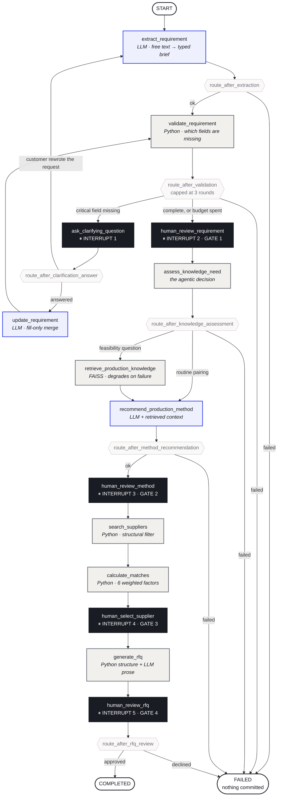
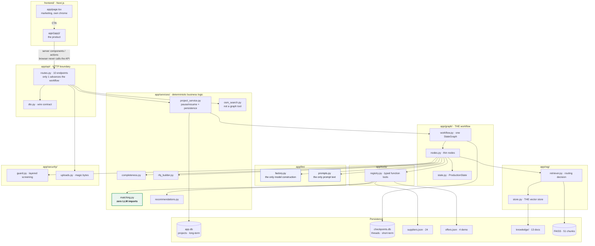
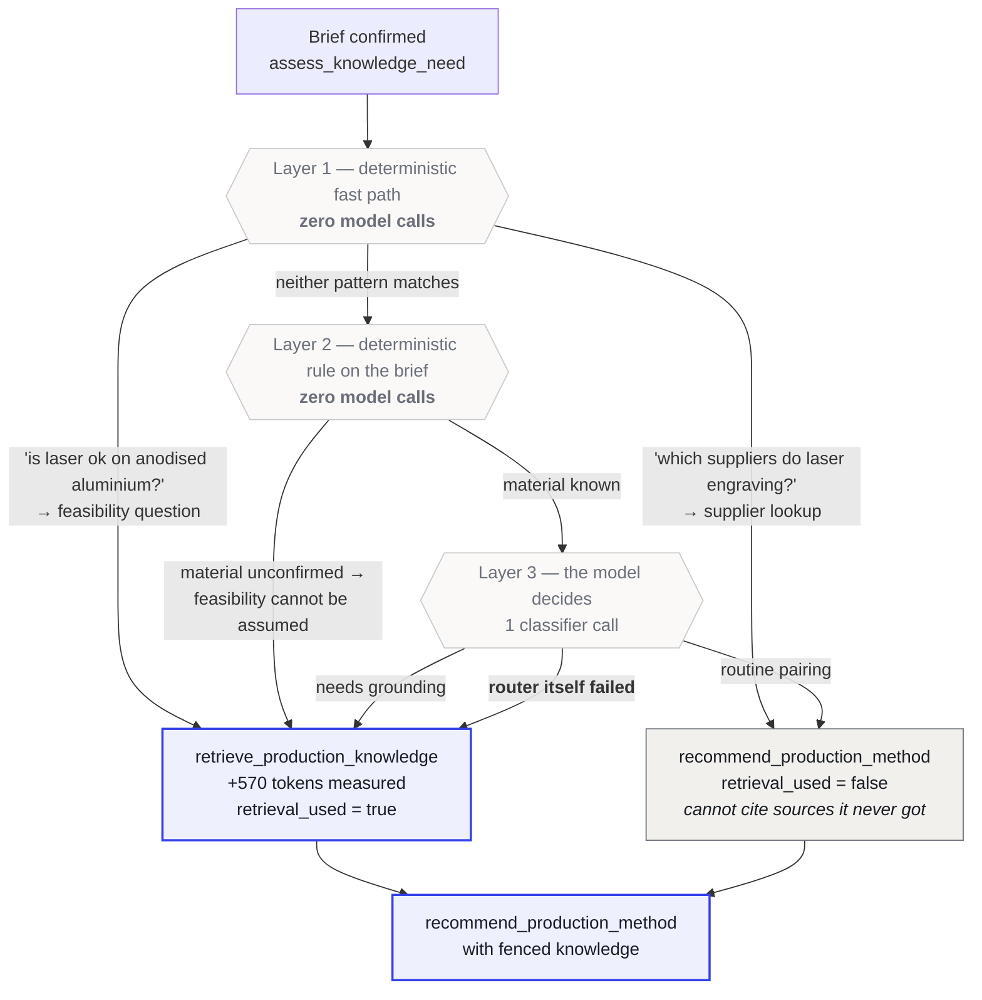
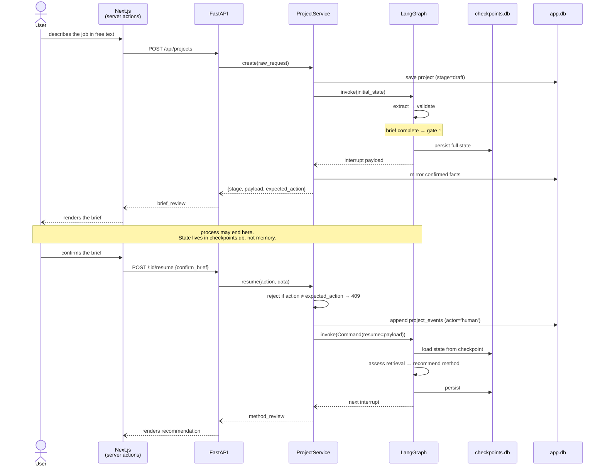

# Architecture diagrams

Five views of the same system, each answering a different question. All are generated from the actual code — node names, edge names and routing functions match `backend/app/graph/workflow.py` exactly, so a diagram that drifts from the code is a bug in the diagram.

GitHub renders Mermaid natively; these are viewable directly in the browser.

| Diagram | Answers |
|---|---|
| 1. The workflow graph | What are the nodes, and where does a human intervene? |
| 2. Layers and import direction | What may depend on what? |
| 3. Who owns which decision | Where does the model act, and where does code? |
| 4. The retrieval decision | What makes the RAG "agentic"? |
| 5. Pause and resume over HTTP | How does a human gate work mechanically? |

---

## 1. The workflow graph

**One `StateGraph`. Five `interrupt()` points. Four of them are approval gates; the fifth is the clarification question.**

Diamonds are conditional edges — each is a named routing function in `workflow.py`, not an inline lambda. Every model-calling node can fail to `END` rather than raising.



**Three things this diagram makes visible:**

- **The clarification loop is bounded.** `ask → update → validate` can cycle, but `route_after_validation` stops at three rounds and proceeds to review with the gap visible rather than interrogating forever.
- **A customer can rewrite the original request** instead of answering. `route_after_clarification_answer` sends that back to `extract_requirement` for a fresh extraction, rather than merging an answer that was never given.
- **Failure is a route, not an exception.** Every LLM-calling node returns a `FAILED` delta on error; the graph routes to a controlled stop. The client receives a typed error, never a stack trace.

---

## 2. Layers and import direction

**Import direction is one-way and enforced by `scripts/audit_architecture.py`.** Nothing imports upward. `graph/` never imports `api/`. `services/matching.py` imports no LLM code at all.



**Note `osm_search.py` bypasses the graph entirely** — it is called straight from a route. Overpass is a shared public service with no uptime guarantee, and a human-approval gate must never be able to stall on a dependency like that.

---

## 3. Who owns which decision

**The single design decision from which every guarantee follows: the model handles language, code owns every fact and every number.**

```mermaid
flowchart LR
    subgraph MODEL["🗣 LLM — language only"]
        direction TB
        M1["Extract brief from free text"]
        M2["Phrase the clarifying question"]
        M3["Merge the answer<br/><i>fill-only, enforced in code</i>"]
        M4["Reason about production method"]
        M5["Explain a score in prose<br/><i>cannot change it</i>"]
        M6["RFQ intro and closing<br/><i>tone only</i>"]
    end

    subgraph CODE["⚙ Python — every fact and number"]
        direction TB
        C1["Which fields are missing"]
        C2["Which supplier can do the method"]
        C3["The 100-point score"]
        C4["Deadline arithmetic"]
        C5["RFQ document structure"]
        C6["retrieval_used and sources"]
    end

    subgraph GUARANTEE["✅ What this buys, mechanically"]
        direction TB
        G1["A capability cannot be invented<br/><i>tool-only access; unknown ids dropped</i>"]
        G2["A score cannot be argued up<br/><i>zero LLM imports, audit-enforced</i>"]
        G3["No step self-completes<br/><i>interrupt() needs a resume payload</i>"]
        G4["Retrieval cannot be falsely claimed<br/><i>set in code from what was retrieved</i>"]
    end

    MODEL -.->|"output validated by<br/>closed Pydantic schema"| CODE
    CODE ==> GUARANTEE

    classDef m fill:#EEF0FE,stroke:#3240EB,color:#191C23
    classDef c fill:#F1F0ED,stroke:#6B6F7A,color:#191C23
    classDef g fill:#EAF5EF,stroke:#1E8E5A,stroke-width:2px,color:#191C23
    class M1,M2,M3,M4,M5,M6 m
    class C1,C2,C3,C4,C5,C6 c
    class G1,G2,G3,G4 g
```



**Why the dotted arrow matters.** Every model response crosses into code through a closed Pydantic schema (`extra="forbid"`). A hallucinated field is a validation error, not silent data — so even a successful prompt injection cannot produce a field the system acts on.

---

## 4. The retrieval decision — what makes the RAG agentic

**Retrieval does not fire on every request.** A dedicated node decides, cheapest signal first. Two of the three layers cost nothing.



**It fails toward retrieving, on purpose.** An unnecessary lookup costs about $0.0002. A confident wrong technical claim costs a customer.

**Measured effect of grounding — same request, retrieval off vs on:**

| | Off | On |
|---|---|---|
| Confidence | medium | **high** |
| Constraints | 1, generic | **4**, including the corpus's line-thickness limit |
| Citations | none | **2 named documents** |

---

## 5. Pause and resume over HTTP

**How a human gate actually works.** The graph does not "wait" in memory — it *stops*, persists, and is re-entered later. This is what makes "close the browser and come back tomorrow" work.



**Two properties worth naming:**

- **The graph is the authority on where it is.** One `/resume` endpoint rather than seven. A mismatched action returns `409` naming the action actually expected — so a stale browser tab gets a correctable answer instead of silently resuming the wrong branch.
- **Every human decision is written to `project_events` with `actor='human'`.** "Who confirmed this method, and when" is answerable after the fact rather than inferred from final state.

---

## Regenerating these

The node and edge names above are copied from `backend/app/graph/workflow.py`. If the graph changes, these diagrams must be updated by hand — there is no generator. To check they still match:

```bash
cd backend && sed -n '/^def build_graph/,/^    return graph/p' app/graph/workflow.py \
  | grep -E "add_node|add_edge|add_conditional"
```
